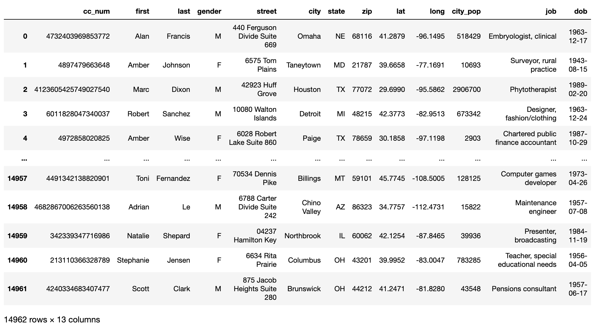
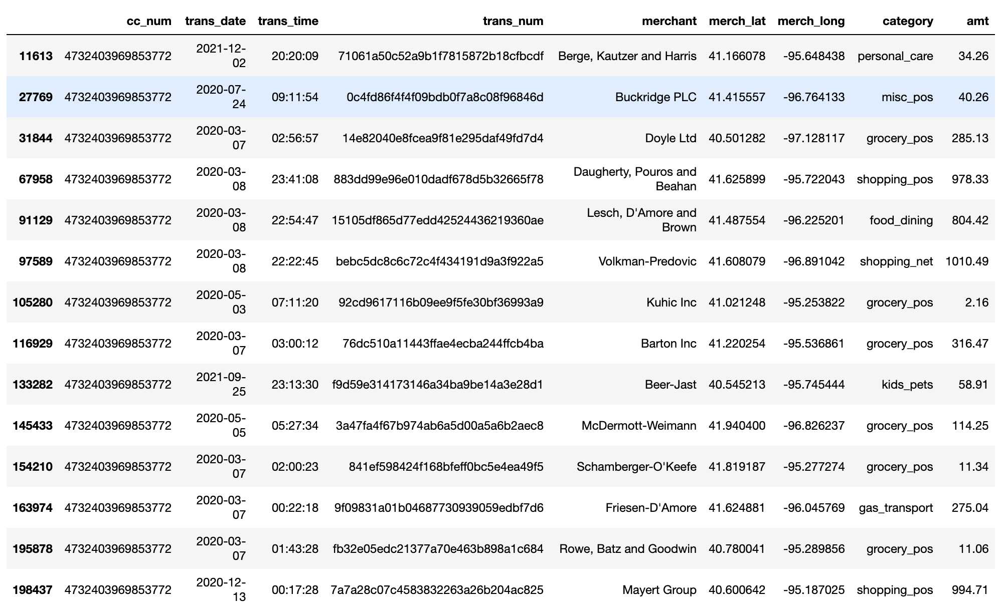
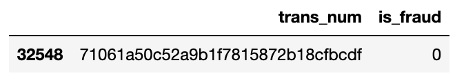

# P7: Credit Card Transactions: Fraud Detection

## Corrections/Clarifications

* none yet

## Overview

You are the owner of a credit card company and recently there has been 
a spike in the number of fraud transaction reports. Unfortunately, there
is no system to detect the fraud transactions before they are made.
You are looking to use the transaction and card holder data of the
last two years and build a model to detect fraud transactions to prevent
your customers from losing trust in your company.

You can decide what features to consider and how to create your
classifier. Your grade will correspond to the accuracy of your
predictions. 50% accuracy and below will give a grade of 0%, whereas
accuracy of 75% and above will give a grade of 100%; any accuracy
between 50 and 75 will be rescaled to a 0-100% grade.  Some models can
get better than 90% accuracy, so we encourage you to keep improving
your model beyond what is necessary for full credit if you have time.

You should create your classifier in a `main.py` file, which will be
the only thing you'll submit.

You can collaborate with your team on the entire project (no
individual part!).  As usual, you cannot work with anybody outside of
your team and can only get help from 320 staff.

## Dataset

We have generated 3 datasets:

1. train
2. test1
3. test2 (secret)

You'll fit your classifier to the training data, then estimate your
accuracy using the test1 data.  We'll compute your final grade based
on test2 data, which is similar but not identical to test1 data.

Each of the 3 datasets consist of 3 files (so there are 9 files total, of which we give you 6):

1. `???_customers.csv`: information about each customer/credit card
2. `???_transactions.csv`: details about the credit card transactions made 
3. `???_is_fraud.csv`: is_fraud=1 means the transaction is fraud; is_fraud=0 means it is not

Here is some data in `train_customers.csv`:



Here is some data in `train_transactions.csv` for the first customer (cc_num 4732403969853772):



Here is the corresponding data from `train_is_fraud.csv`:



After matching the transaction numbers, the credit card number and considering the `is_fraud` column, we can see that transaction `71061a50c52a9b1f7815872b18cfbcdf` made using Alan Francis's credit card (cc_num 4732403969853772) was not fraud (is_fraud=0).

Each row in `???_transactions.csv` represents a transactions made using customer's credit card. Each row contains the credit card number, date, time, the id of the the transaction they made, the name of the merchant, the latitude and longitude of the merchant, the category of the purchase and the amount of the transaction.

Each row in `???_customers.csv` represents a credit card and the associated customer. Each row containts the credit card number, the first and last name of the customer, their gender and other useful details about every credit card holder.

The amount of a transaction has the potential to be a good indicator for
indentifying fraud transactions but a little bit of brainstorming will help you
identify what other features may be a good predictor for the machine learning model.

## `FraudDetector` class

The goal of this project is to build a classifier that, given customer and
transaction data, can predict whether those transactions are fraud or not. 
There are a number of ways that you can go about this and a
number of ways that you can use the data (or not use portions of the
data); the freedom is yours.

You'll write your classifier as a class called `FraudDetector` in your
`main.py` file.  We require two methods (feel free to add more as
useful): `fit` and `predict`.

We recommend reading `tester.py` to understand how we expect your
class to work.  We intentionally made tester.py very simple this time
-- only 80 lines of code!

### Method 1: `fit`

Somebody using your class (and the tester) will call `fit` something
like this:

```python
from main import FraudDetector
model = FraudDetector()
train_customers = pd.read_csv("data/train_customers.csv")
train_transactions = pd.read_csv("data/train_transactions.csv")
train_is_fraud = pd.read_csv("data/train_is_fraud.csv")
model.fit(train_customers, train_transactions, train_is_fraud)
```

We don't have any requirements on what `fit` does (no need to output
or return anything), but you'll probably want to fit an underlying
`sklearn` model (for example, a `LogisticRegression`) to the data for
purposes of later prediction.

### Method 2: `predict`

Somebody using your class (and the tester) will call `predict` something
like this:

```python
test_customers = pd.read_csv("data/test1_customers.csv")
test_transactions = pd.read_csv("data/test1_transactions.csv")
y_pred = model.predict(test_customers, test_transactions)
```

`predict` should return a numpy array.  If `y_pred[n]` is 1, that
means you predict the transaction at index `n` is a fraud transaction;
otherwise, you're predicting it not a fraud transaction.

## Hints and Suggestions

* you can implement a custom classifier from scratch if you like, but we imagine most of you will have an sklearn pipeline as an attribute in your class, with your `fit` method fitting the pipeline and your `predict` method using the pipeline for predictions

* start simple, then add complexity.  For example, you only need to get >50% accuracy to get some points, and a simple `LogisticRegression` based only on `amt` should have an accuracy score around 50%.

* as you consider features for your model, it's easier to start with just the `???_transactions.csv` file (ignoring the customer data), as each transaction row corresponds to exactly one outcome/prediction.  We were able to train a simple model just based on the user data that achieved an accuracy of 65%, completely ignoring the customer data.

* to reach a grade of 100%, you'll probably need to use the comster data that describes more information about a particular user.

* you're welcome to learn new classification models in sklearn and use them for this project, but we imagine most of you will build pipelines based on LogisticRegression, the classifier we learned in class.  Remember that in many scenarios LogisticRegression does best in a pipeline where there is a preceding StandardScaler.  LogisticRegression doesn't like large/small numbers or non-centered data, so StandardScaler transforms the data to work better with LogisticRegression.

* running `python3 tester.py` defaults to `python3 tester.py main test1`.  This will give you a general estimate of your final grade, but we'll run `python3 tester.py main test2` to actually compute that; you cannot run on test2, as we are not releasing `test2_transactions.csv`, etc.  Based on noise, your grade may be better or worse for test1 vs. test2.  Here are some tips to avoid surprises:

  * don't read any CSVs directly in your `main.py`; just use the DataFrames passed to your methods to avoid inadvertantly hardcoding paths

  * accuracy of 75 corresponds to a grade of 100%.  We suggest you work to overshoot 75% by a bit in case you do slightly worse on test2 than test1

  * some models are more vulnerable than others to noise in accuracy scores for different train/test datasets.  You may want to do cross validation in your `fit` method and prints some stats.  How will depend on other design choices you make, but your instructor's model has a debug print something like the following in `fit` (a high standard deviation would indicate I'm more likely to be unlucky with getting a very different score on test2 than test1):

```python
scores = cross_val_score(model, train_transactions[self.xcols], train_is_fraud["is_fraud"])
print(f"AVG: {scores.mean()}, STD: {scores.std()}\n")
```

  * if you plan to work with your team members (not required, as usual), consider how you may want to divide the work.  One possibility: each team member could try a different model; after comparing them, all team members could submit the one model that scores best.  Alternatively, each team member could be responsible for computing different per-user stats to use as features for training/predicting.  Of course, avoid getting in a situation where you are dependent on any one person to complete the project; this project should be a reasonable amount of work, even for somebody working individually.
